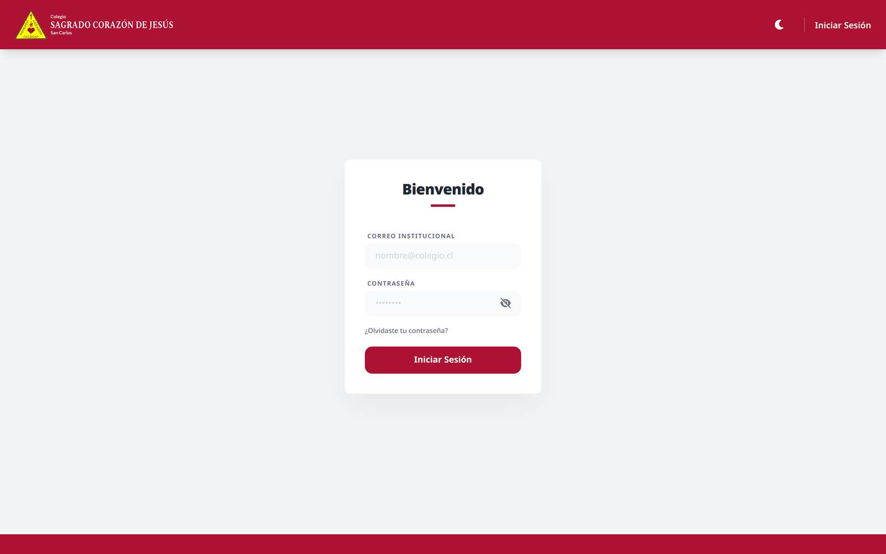
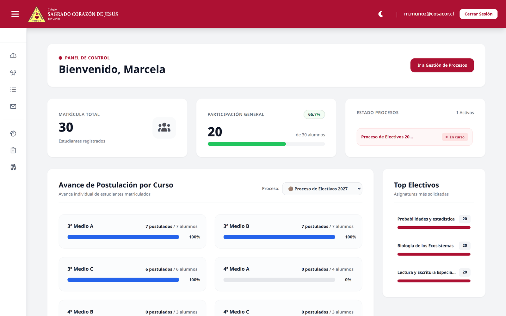
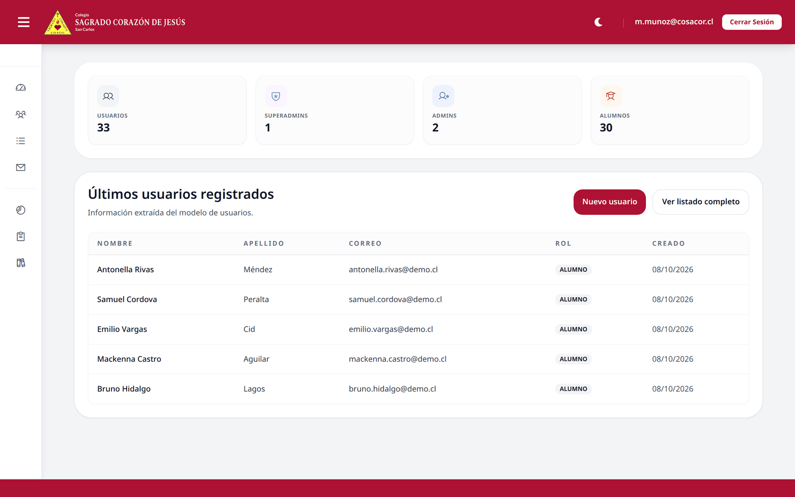
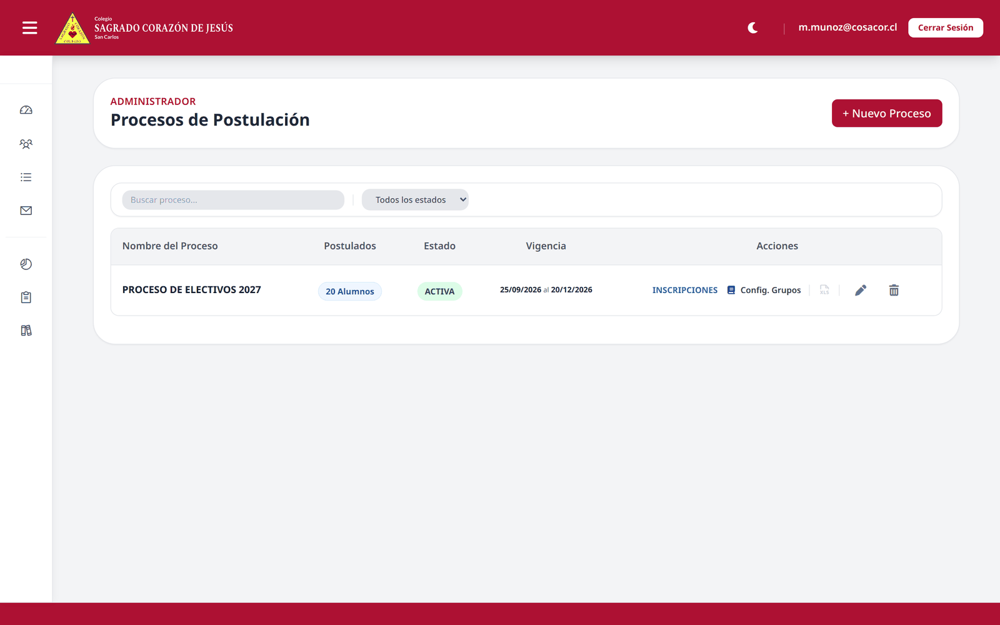
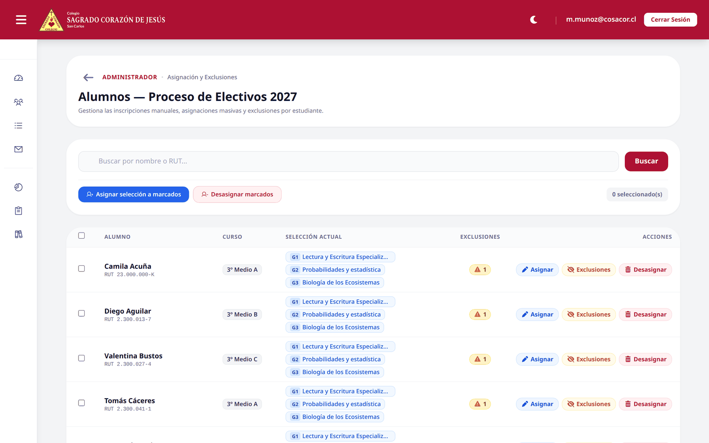
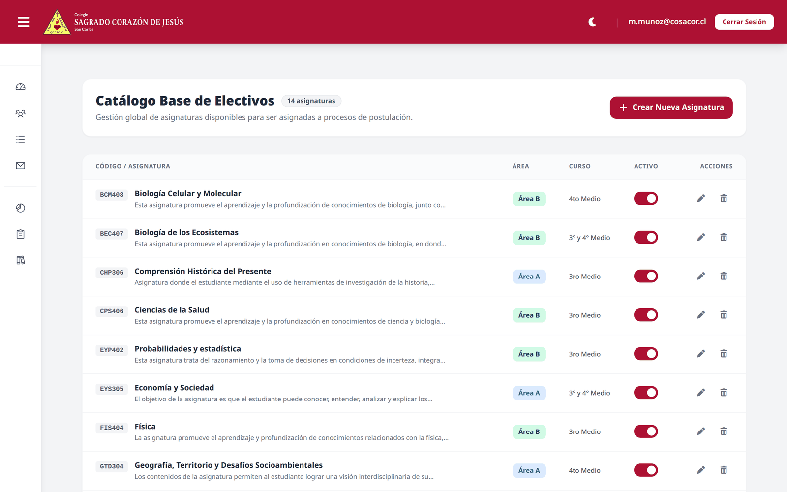
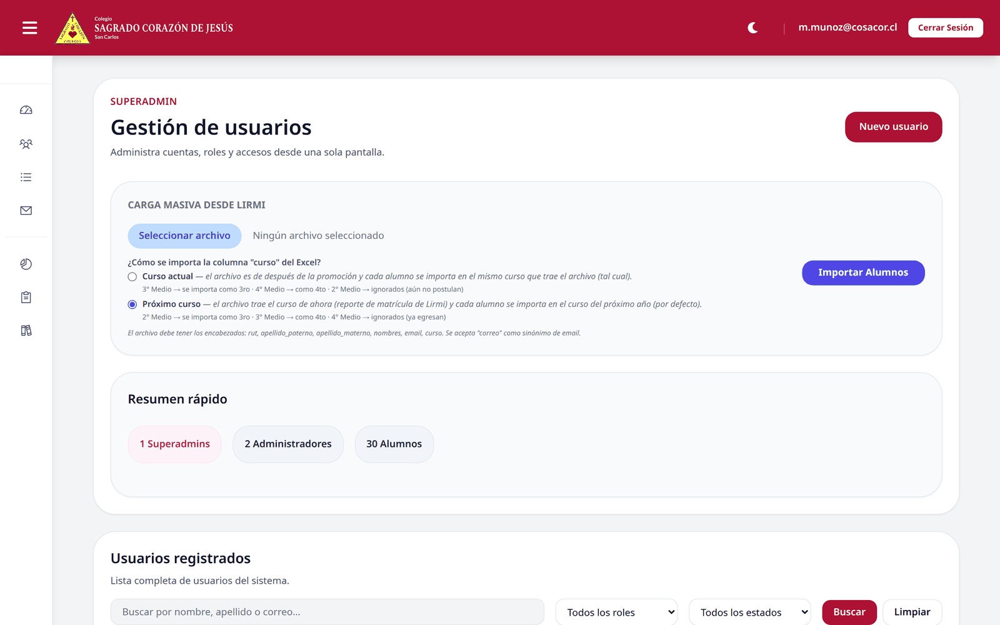
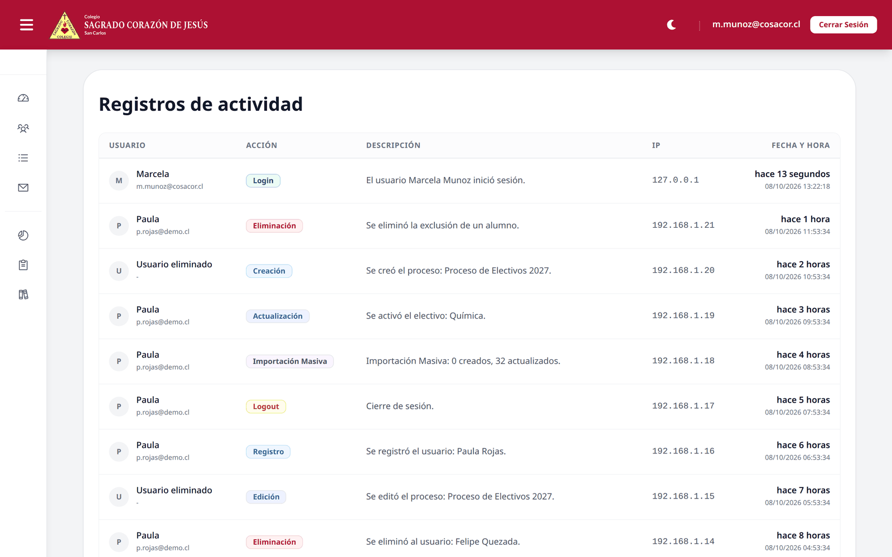
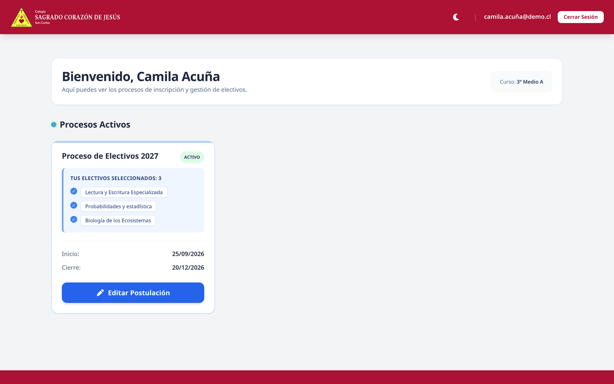
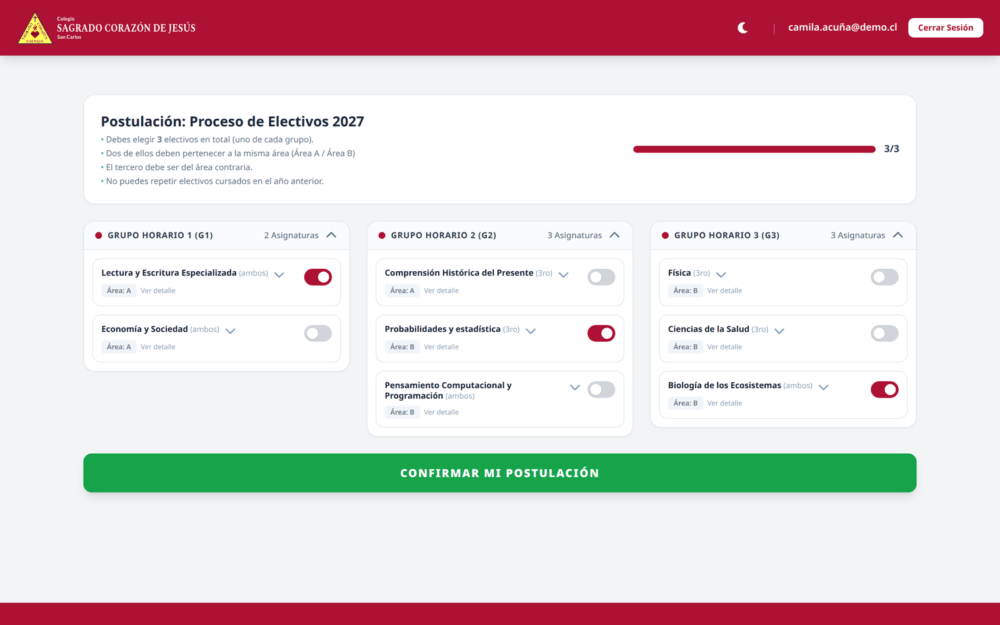

# Sistema de Gestión y Registro de Electivos Escolares

Plataforma web para **inscripción automatizada de asignaturas electivas** en un establecimiento de educación media: los estudiantes postulan sus electivos según reglas de negocio del colegio, y el equipo directivo administra catálogo, procesos, matrícula y auditoría desde un panel unificado.

> **Nota de Confidencialidad:** el código fuente original vive en un repositorio privado por razones de propiedad y seguridad de la institución. Este espacio público reúne la documentación, las decisiones de diseño, el modelo de datos y las capturas de la solución.

---

## 📸 Capturas

### Inicio de sesión

---

### Panel de control (Administrador)

*KPIs de matrícula, participación por proceso, estado de los procesos vigentes, avance de postulación curso por curso y los electivos más solicitados.*

---

### Dashboard de Superadministrador

---

### Procesos de postulación

*Cada proceso tiene su ventana de vigencia, su estado (`programada` · `activa` · `cerrada`) y acceso directo a inscripciones, configuración de grupos y exportación.*

---

### Alumnos de un proceso — inscripciones y exclusiones

*Inscripciones manuales, asignación y desasignación masiva, y exclusiones por electivo a nivel de estudiante.*

---

### Catálogo base de electivos

*Asignaturas con código, descripción, área (A/B), curso de vigencia (3°, 4° o ambos) y activación sin borrar el histórico.*

---

### Gestión de usuarios y carga masiva desde LIRMI

*CRUD de usuarios por rol, acciones masivas, restablecimiento de contraseña e importación de nóminas desde Excel.*

---

### Registros de actividad (auditoría)

*Trazabilidad de acciones con usuario, descripción, IP y fecha, con etiqueta visual por tipo de acción.*

---

### Panel del alumno

---

### Selección de electivos

*Los electivos se agrupan en **grupos horarios G1 · G2 · G3** y el estudiante elige uno por grupo, con validación de las reglas del colegio en pantalla.*

---

## 🛠️ Stack Tecnológico

Construido como monolito con separación clara de responsabilidades:

| Capa | Tecnología |
|------|-----------|
| **Backend** | PHP 8.3 · Laravel 13 |
| **Componentes interactivos** | Livewire 4 |
| **Base de datos** | MariaDB / MySQL |
| **Frontend** | Blade · Tailwind CSS 3 · Vite 8 · Alpine.js · Trix (editor enriquecido) |
| **Importación / exportación** | maatwebsite/excel 3.1 (Lector LIRMI y reportes XLSX) |
| **Saneado de contenido** | HTMLPurifier (contenido enriquecido) |
| **Notificaciones en UI** | php-flasher |
| **Integración Google** | google/apiclient (OAuth 2.0 + Gmail) |
| **Control de versiones / CI** | Git · GitHub · GitHub Actions |

---

## 🎯 Funcionalidades

### 👤 Superadministrador
- **Dashboard** con usuarios totales, desglose por rol y últimos registros.
- **Gestión de usuarios**: crear, editar, eliminar, cambiar rol, activar/desactivar y restablecer contraseñas — con acciones en lote.
- **Carga masiva desde LIRMI** con dos interpretaciones de la columna `curso`:
  - *Curso actual* — el archivo es posterior a la promoción: `3° Medio → 3ro`, `4° Medio → 4to`; `2° Medio` se ignora (aún no postula).
  - *Próximo curso* *(por defecto)* — el archivo trae la matrícula vigente: `2° Medio → 3ro`, `3° Medio → 4to`; `4° Medio` se ignora (ya egresan).
  - Encabezados esperados: `rut`, `apellido_paterno`, `apellido_materno`, `nombres`, `email` (acepta `correo`) y `curso`.
  - Validación a nivel de fila: la importación informa exactamente en qué fila falló y por qué.
- **Auditoría** paginada de toda la actividad del sistema.

### 🎓 Administrador
- **Panel de control**: matrícula total, participación general, estado de los procesos, avance de postulación por curso y *top* de electivos.
- **Catálogo base de electivos**: alta/edición/baja con código, descripción, área, curso de vigencia y adjunto PDF; se activa o desactiva sin destruir el histórico.
- **Procesos de postulación**: CRUD con ventana de vigencia y ciclo de estados.
- **Gestión de alumnos por proceso**: inscripción manual, asignación y desasignación masiva, y **exclusiones** (un estudiante no puede cursar un electivo puntual).
- **Oferta por grupos horarios**: cada electivo se ofrece en `G1` / `G2` / `G3` con su **cupo máximo**, gestionado de forma transaccional.
- **Reportes XLSX**: padrón de alumnos, resumen por electivo y hoja de cálculo de grupos/secciones.

### 🧑‍🎓 Alumno
- Panel con los procesos activos y los electivos ya seleccionados.
- **Selección de electivos** con las reglas del colegio aplicadas en pantalla:
  - **3 electivos en total, uno por cada grupo horario (G1 · G2 · G3).**
  - Dos deben pertenecer a la misma **área** (A / B) y el tercero a la contraria.
  - No se pueden repetir electivos cursados el año anterior.
- Barra de progreso de la postulación y confirmación final.

### 🔒 Seguridad y transversal
- **Tres roles** (`superadmin`, `admin`, `alumno`) con **4 Policies** de autorización (`UserPolicy`, `PostulacionPolicy`, `ElectivoPolicy`, `SelecElectivoPolicy`).
- **Recuperación de contraseña** por enlace enviado por correo.
- **OAuth 2.0 con Google** para administradores, con *refresh token* cifrado en base de datos.
- **RUT normalizado**: se almacena sin puntos ni guion y se valida de forma consistente en toda la aplicación.
- **Contenido enriquecido saneado** con HTMLPurifier antes de persistirlo.
- Sesiones y *cache* en base de datos, estados de usuario (activo/inactivo).
- **Índices optimizados** para las consultas más frecuentes.

---

## ✅ Calidad

- **123 tests automatizados · 481 aserciones**, en verde (29 archivos: 27 de funcionalidad y 2 unitarios).
- **Integración continua** con GitHub Actions ante cada *push*.
- Tests sobre SQLite en memoria, por lo que corren rápido y sin necesidad de una base de datos externa.

---

## 🎯 Aprendizajes y Desafíos Técnicos

- **Reglas de negocio que cambian cada año**: el sistema fue diseñado para que el equipo directivo cree, edite, pause o excluya asignaturas desde la interfaz — sin tocar código.
- **Importación real desde un sistema externo**: los archivos de LIRMI no siempre traen las columnas ni el formato esperado. Se trabajó sobre tolerancia a encabezados, normalización de RUT, detección de nivel y sección, y reporte de errores **por fila** para que la persona que importa pueda corregir el archivo.
- **Modelo de grupos horarios (G1/G2/G3)**: pasar de una lista plana de electivos a una oferta con grupos y cupos obligó a replantear la unicidad de las selecciones y cómo se calcula la disponibilidad.
- **Trazabilidad**: cada acción relevante queda registrada, para poder responder ante dudas del colegio.

---

## ✉️ Contacto y Demostración en Vivo

Si deseas conocer más detalles sobre la implementación, o ver una demostración guiada de la plataforma en funcionamiento, no dudes en contactarme a través de mi correo **j.leiva2203@gmail.com**.
